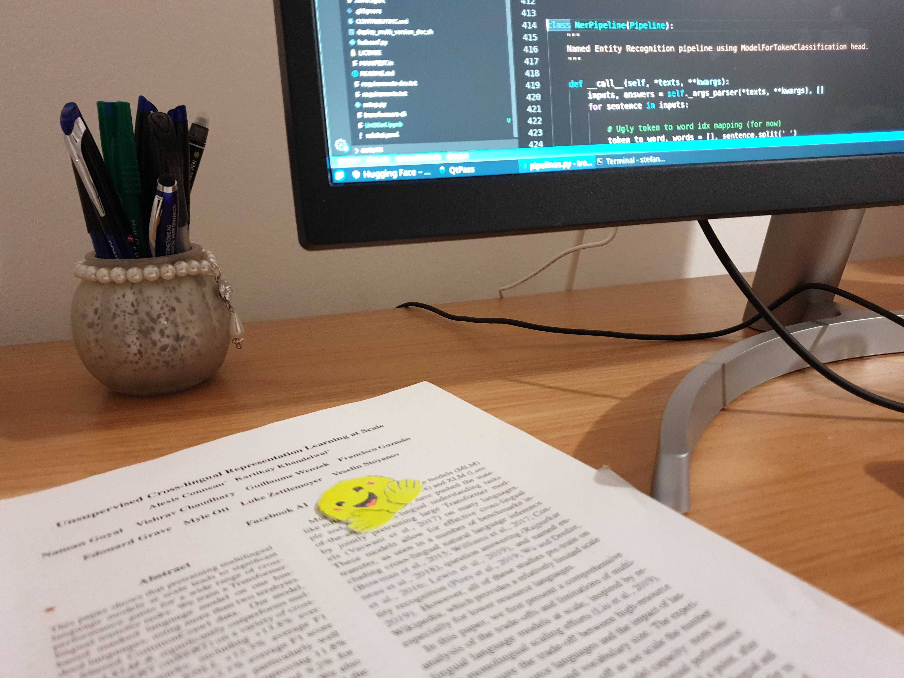

### Hi there 👋

* I'm currently working on the awesome [Flair](https://github.com/flairNLP/flair)
  library and love contributing to [🤗 Transformers](https://github.com/huggingface/transformers)

* I'm working at [Bavarian State Library](https://github.com/dbmdz) now and please
  visit, watch and star our [pre-trained language models repo](https://github.com/dbmdz/berts)!

### Latest news

Latest news of new language models, PRs and many more!

* 18.08.2020: French BERT model, trained on Historic newspapers from Europeana:
  find the model [here](https://huggingface.co/dbmdz/bert-base-french-europeana-cased)
  and the corresponding repository [here](https://github.com/stefan-it/europeana-bert)

### Contact

Please open an issue in the corresponding issue or tag me (@stefan-it) in
issues/prs/commits on GitHub :)
